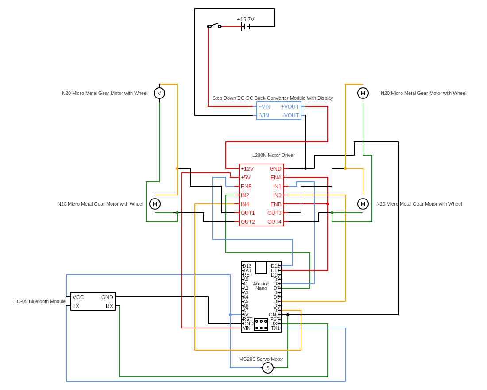

# SoccerBot Project

<section>
    <h2 style="text-decoration: underline">Description</h2>
    
This project is an assignment for a course in my University (Independent University, Bangladesh). We are required to build a four-wheeled remote controllable car with a servo motor in front, acting as a kicking mechanism.

</section>

<section>
    <h2 style="text-decoration: underline">Parts Used</h2>
    <ol>
        <li>4 &times; Wheels</li>
        <li>4 &times; Motors</li>
        <li>4 &times; 18650 7800mAh Li-ion rechargable batteries</li>
        <li>1 &times; 18650 4 &times; battery holder</li>
        <li>1 &times; Dual Terminal Mini switch</li>
        <li>1 &times; MG90S Micro Metal Servo Motor</li>
        <li>1 &times; Step Down DC-DC Buck Converter</li>
        <li>1 &times; L298N Dual Motor Driver</li>
        <li>1 &times; HC-05 Bluetooth Module</li>
        <li>1 &times; Mini Breadboard</li>
        <li>1 &times; Arduino Nano</li>
        <li>15 &times; Male-Female Connecting Wires</li>
        <li>13 &times; Connecting Wires (any)</li>
    </ol>
</section>

<section>
    <h2 style="text-decoration: underline">Circuit Diagram</h2>
    
</section>

<section>
    <h2 style="text-decoration: underline">Code short description</h2>
    

    At first, the header file for Servo is included.
    Then the digital and digital PWM (Pulse Width Modulation) pins are defined.
    

    

    The functions used to move the car forward, backward, turn left, turn right, go forward left, forward right, backward left, and backward right are defined.
    

    

    In the setup function, pin modes are all defined as output and one pin is attached to the servo motor. 
    Serial.begin(9600) means that the Arduino Nano board will send and receive 9600 bits per second. 
    When a bluetooth module (HC-05 or other) is connected to the Arduino Nano via the RX and TX pins, the Arduino receives Serial data from the Bluetooth Module.
    

    

    In the loop function, we accept an incoming byte from the Serial input and then according to the byte received, we call the function to move the car.
    

</section>

<section>
    <h2 style="text-decoration: underline">Interface Short Description</h2>
    
The interface was made using <a href="https://ai2.appinventor.mit.edu" target="_blank">MIT App inventor</a>
    

    
The .aia file can be imported to a new project created in <a href="https://ai2.appinventor.mit.edu" target="_blank">MIT App inventor</a> and the interface, and the code can be viewed.
    

    
Currently, the interface does not support any speed controlling system although the Arduino code does.
    

</section>